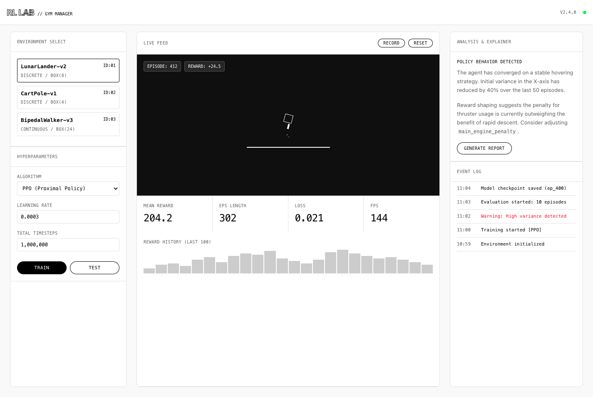

# RL/Gym Visualizer

A lightweight web application for visualizing reinforcement learning training and evaluation.



## Features

- Train RL agents on CartPole-v1 environment
- Algorithms: DQN and PPO (via Stable-Baselines3)
- Real-time training metrics visualization
- Recorded evaluation playback
- Algorithm explanations

## Project Structure

```
rl-sandbox/
├── backend/                    # FastAPI backend
│   ├── app/
│   │   ├── db/                 # Database layer
│   │   │   ├── database.py     # SQLite connection
│   │   │   ├── schema.sql      # DB schema
│   │   │   ├── runs_repository.py
│   │   │   └── events_repository.py
│   │   ├── models/             # Pydantic models
│   │   │   ├── environment.py
│   │   │   ├── event.py
│   │   │   └── run.py
│   │   ├── routers/            # API endpoints
│   │   │   ├── environments.py
│   │   │   └── runs.py
│   │   ├── storage/            # File storage
│   │   │   └── run_storage.py
│   │   └── main.py
│   ├── data/                   # SQLite database (created on startup)
│   ├── runs/                   # Run artifacts (created per run)
│   └── requirements.txt
├── frontend/                   # Next.js frontend
│   ├── src/
│   │   ├── app/
│   │   │   ├── layout.tsx
│   │   │   ├── page.tsx
│   │   │   └── globals.css
│   │   └── components/
│   │       └── layout/         # 3-column layout components
│   ├── package.json
│   └── tailwind.config.ts
├── docs/                       # Documentation
│   ├── api-contract.md         # API specification
│   ├── data-model.md           # Data model docs
│   └── assets/
├── Makefile                    # Dev scripts
└── README.md
```

## UI Design

The frontend uses a **responsive 3-column dashboard layout**:
- **Left sidebar:** Environment selection + Hyperparameters
- **Center panel:** Live feed visualization + Metrics + Reward history
- **Right sidebar:** Analysis & Explainer + Event log

On mobile, sidebars collapse into slide-out panels with bottom navigation.

## Prerequisites

- Python 3.10+
- Node.js 18+
- npm

## Quick Start

### 1. Install Dependencies

```bash
# Install all dependencies
make install
```

Or install separately:

```bash
# Backend
cd backend
python -m venv .venv
source .venv/bin/activate  # On Windows: .venv\Scripts\activate
pip install -r requirements.txt

# Frontend
cd frontend
npm install
```

### 2. Start Development Servers

```bash
# Start both servers
make dev
```

Or start separately:

```bash
# Terminal 1 - Backend
make backend
# Or: cd backend && source .venv/bin/activate && uvicorn app.main:app --reload

# Terminal 2 - Frontend
make frontend
# Or: cd frontend && npm run dev
```

### 3. Access the Application

- **Frontend:** http://localhost:3000
- **Backend API:** http://localhost:8000
- **API Docs:** http://localhost:8000/docs

## API Endpoints

Base URL: `http://localhost:8000/api/v1`

| Endpoint | Method | Description |
|----------|--------|-------------|
| `/environments` | GET | List supported environments |
| `/runs` | GET | List all runs |
| `/runs` | POST | Create a new run |
| `/runs/{id}` | GET | Get run details |
| `/runs/{id}/start` | POST | Start training |
| `/runs/{id}/stop` | POST | Stop training |
| `/runs/{id}/events` | GET | List run events |
| `/health` | GET | Health check |

See [docs/api-contract.md](./docs/api-contract.md) for full API documentation.

## Development

See [docs/README.md](./docs/README.md) for detailed documentation.

## License

MIT
