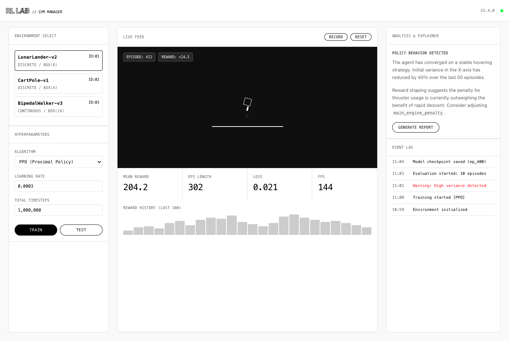

# RL Sandbox (RL Gym Visualizer)

Lightweight RL training + evaluation visualizer built with FastAPI (backend) and Next.js (frontend).



## What this project does

- Trains RL agents with PPO and DQN (SB3).
- Applies training presets (`fast`, `stable`, `high_score`) with server-side bounds validation.
- Streams live metrics over SSE and live environment frames over WebSocket.
- Records evaluation runs and serves MP4 artifacts.
- Provides a responsive 3-column dashboard for environment setup, live feed, and logs.

## Architecture

```
Frontend (Next.js)  <---- REST / SSE / WS ---->  Backend (FastAPI + Gymnasium + SB3)
        Vercel-ish                                Fly.io-ish / long-running process
```

## Supported environments

| Environment | Action Space | Observation Space | Algorithms |
|---|---|---|---|
| `LunarLander-v3` | Discrete (4) | Box(8) | PPO, DQN |
| `CartPole-v1` | Discrete (2) | Box(4) | PPO, DQN |
| `BipedalWalker-v3` | Continuous (4) | Box(24) | PPO |

## Repository layout

```text
rl-sandbox/
├── backend/
│   ├── app/
│   │   ├── db/            # SQLite schema + repositories
│   │   ├── models/        # Pydantic/domain models
│   │   ├── routers/       # REST endpoints
│   │   ├── streaming/     # SSE / WebSocket infrastructure
│   │   ├── storage/       # Run artifact storage
│   │   ├── training/      # Training/evaluation runners
│   │   └── main.py
│   └── requirements.txt
├── frontend/
│   ├── src/app/           # Next app shell/page
│   ├── src/components/    # Dashboard UI
│   ├── src/hooks/         # Runtime hooks (training/streaming)
│   └── src/services/      # API client
├── docs/                  # Contracts, data model, test notes
├── roadmap.md             # Prompt roadmap
├── errors.md              # Known issues + latest working fixes
├── test-smoke.sh
└── test-comprehensive.sh
```

## Prerequisites

- Python 3.10+
- Node.js 18+
- npm

## Quick start

### 1) Install dependencies

```bash
make install
```

### 2) Run the app

```bash
make dev
```

Services:

- Frontend: `http://localhost:3000`
- Backend API: `http://localhost:8000`
- Backend docs: `http://localhost:8000/docs`

## Run tests

Backend must be running first.

```bash
make test-smoke
make test
```

Manual invocation with explicit host (useful on some systems):

```bash
API_BASE=http://127.0.0.1:8000/api/v1 HEALTH_URL=http://127.0.0.1:8000/health bash test-smoke.sh
API_BASE=http://127.0.0.1:8000/api/v1 HEALTH_URL=http://127.0.0.1:8000/health bash test-comprehensive.sh
```

## Key API routes

Base API: `http://localhost:8000/api/v1`

| Route | Method | Purpose |
|---|---|---|
| `/environments` | GET | List available environments |
| `/environments/{id}/preview` | GET | Get idle preview frame (JPEG) |
| `/runs/presets` | GET | List preset tables + hyperparameter bounds |
| `/runs` | POST | Create run |
| `/runs/{id}/start` | POST | Start training |
| `/runs/{id}/stop` | POST | Stop training |
| `/runs/{id}/evaluate` | POST | Start evaluation |
| `/runs/{id}/stream/metrics` | GET (SSE) | Live metrics stream |
| `/runs/{id}/ws/frames` | WS | Live frame stream |
| `/runs/{id}/artifacts/*` | GET | Config/metrics/eval artifacts |

For full schemas and examples, see `docs/api-contract.md`.

## Environment variables

### Backend

- `CORS_ORIGINS`: comma-separated allowed origins (default local origins).
- `RLV_RUNS_DIR`: custom path for run artifacts (default `backend/runs`).

### Frontend

- `NEXT_PUBLIC_API_URL`: backend API base (default `http://localhost:8000/api/v1`).

## Documentation map

- `docs/api-contract.md` — API contract.
- `docs/data-model.md` — storage and schema model.
- `docs/testing-guide-prompt-11.md` — runtime behavior and UI testing notes.
- `docs/prompt-11-analysis-and-tests.md` — prompt-11 implementation review.
- `docs/prompt-13-analysis-and-tests.md` — prompt-13 implementation review.
- `docs/prompt-14-analysis-and-tests.md` — prompt-14 implementation review.
- `docs/prompt-15-analysis-and-tests.md` — prompt-15 implementation review.
- `errors.md` — root causes and latest working fixes (read before flow changes).

## Roadmap status

Prompts 01–15 in `roadmap.md` are executed. Prompts 16+ are planned follow-up work.

## License

MIT
