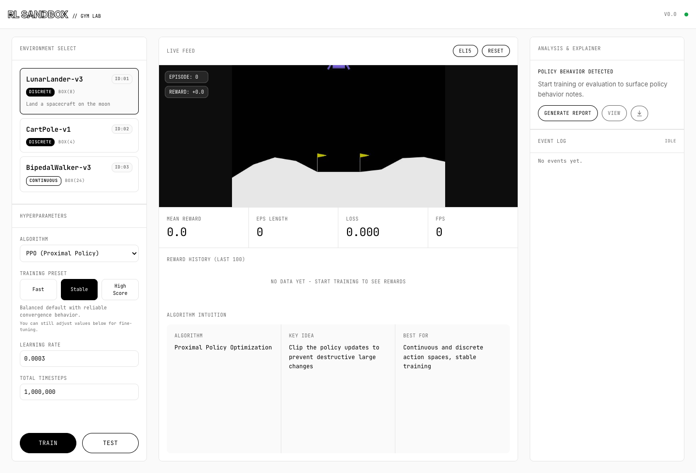

# RL Sandbox v1.0

Train and watch reinforcement learning agents in a clean browser dashboard.



## What it does

- Train PPO and DQN agents on a small set of ready-to-run environments.
- Watch live frames, rewards, and event updates in one dashboard.
- Run evaluation episodes and review saved artifacts.
- Start locally in a few commands.

## Architecture

```text
Frontend dashboard (Next.js) <-> Backend API (FastAPI + Gymnasium + Stable-Baselines3)
```

The frontend can load by itself, but training and evaluation need a reachable backend.

## Supported environments and features

| Environment | Algorithms | Live training | Evaluation |
|---|---|---|---|
| `LunarLander-v3` | `PPO`, `DQN` | Yes | Yes |
| `CartPole-v1` | `PPO`, `DQN` | Yes | Yes |
| `BipedalWalker-v3` | `PPO` | Yes | Yes |

## Repository layout

```text
rl-sandbox/
├── frontend/              # Next.js dashboard
├── backend/               # FastAPI service and RL runners
├── deploy/selfhosted/     # Optional hosted backend setup
├── docs/                  # Deployment notes and supporting docs
├── scripts/               # Helper scripts
└── README.md
```

## Prerequisites

- Python 3.10+
- Node.js 20.19+ (22 LTS recommended)
- npm

## Quick start

```bash
git clone https://github.com/lordSauron1710/rl-sandbox.git
cd rl-sandbox
cp .env.example .env
make install
make dev
```

Open:

- Frontend: `http://127.0.0.1:3000`
- Backend API: `http://127.0.0.1:8000/api/v1`
- Backend docs: `http://127.0.0.1:8000/docs`

## Test commands

```bash
make test-smoke
make test
```

## Key API routes

| Route | Method | Purpose |
|---|---|---|
| `/health` | `GET` | Health check |
| `/api/v1/environments` | `GET` | List supported environments |
| `/api/v1/runs` | `POST` | Create a run |
| `/api/v1/runs/{id}/start` | `POST` | Start training |
| `/api/v1/runs/{id}/stop` | `POST` | Stop training |
| `/api/v1/runs/{id}/evaluate` | `POST` | Run evaluation |

## Environment variables

Most users can keep the defaults in `.env.example` for local use.

| Variable | Used for |
|---|---|
| `NEXT_PUBLIC_API_URL` | Frontend API base URL |
| `APP_ENV` | Backend mode |
| `RLV_ACCESS_TOKEN` | Protecting a public backend |
| `RLV_DEPLOYMENT_BOUNDARY` | Marking a production backend as `public` or `private` |
| `FRONTEND_URL` | Allowed frontend origin for hosted setups |
| `CORS_ORIGINS` | Backend browser allowlist |
| `TRUSTED_HOSTS` | Allowed backend hostnames |

For hosted deployment steps, see `docs/guides/deployment.md`.

## Documentation map

- `docs/guides/deployment.md`: deploy the frontend and backend
- `errors.md`: known issues and latest fixes
- `roadmap.md`: implementation history

## Roadmap status

- v1.0 is ready to use.

## License

MIT
## 💰 Buy Me A Coffee

[](https://buymeacoffee.com/sandeepvangara)