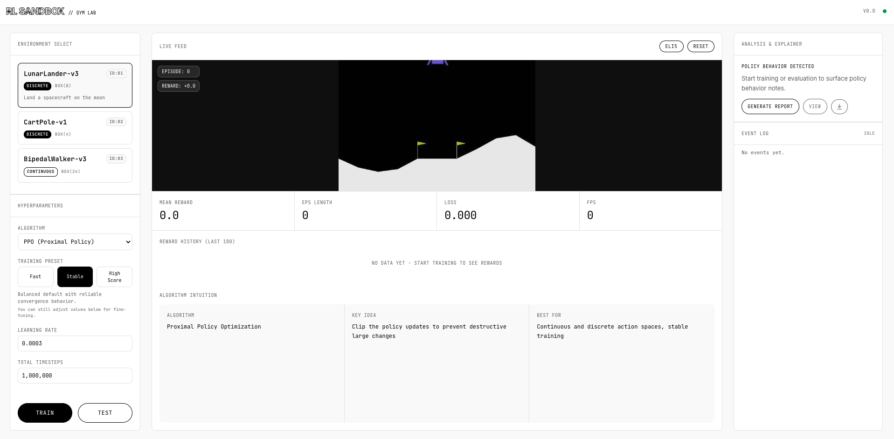
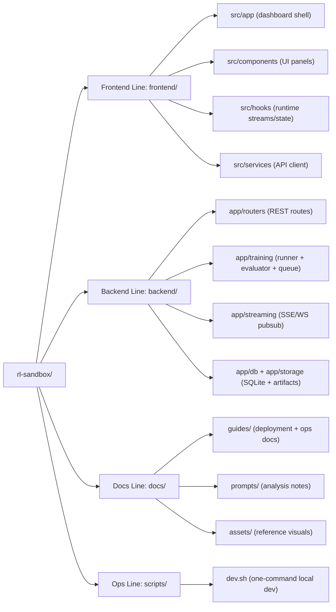

# RL Sandbox (RL Gym Visualizer)

Lightweight RL training and evaluation visualizer with a Next.js dashboard and FastAPI backend.

> **Important:** The Vercel-hosted version is a **frontend demo only**, not the full working app.  
> To use training, evaluation, and live backend streams end-to-end, run the project locally (`make install && make dev`) or connect to a deployed backend.
> Live frontend demo: [https://rl-sandbox-three.vercel.app/](https://rl-sandbox-three.vercel.app/)

[](https://github.com/lordSauron1710/rl-sandbox/actions/workflows/ci.yml)
[](https://github.com/lordSauron1710/rl-sandbox/stargazers)
[](https://github.com/lordSauron1710/rl-sandbox/network/members)
[](https://github.com/lordSauron1710/rl-sandbox/issues)
[](#license)



## What it does

- Trains PPO and DQN agents on supported Gymnasium environments.
- Streams live metrics (SSE) and frames (WebSocket) to a single-page dashboard.
- Runs evaluation episodes, records MP4 artifacts, and serves latest results.
- Persists run metadata in SQLite and artifacts on disk.
- Supports a frontend-only Vercel demo plus a full local run mode for training/evaluation.

## Architecture

```text
Frontend (Next.js)  <---- REST / SSE / WS ---->  Backend (FastAPI + SB3 + Gymnasium)
Vercel demo or local frontend                     local or hosted long-running backend
```

## Supported environments and features

| Environment | Action Space | Observation Space | Algorithms |
|---|---|---|---|
| `LunarLander-v3` | Discrete (4) | Box(8) | PPO, DQN |
| `CartPole-v1` | Discrete (2) | Box(4) | PPO, DQN |
| `BipedalWalker-v3` | Continuous (4) | Box(24) | PPO |

## Repository subway map


```mermaid
flowchart LR
  root["rl-sandbox/"]

  root --> frontend["Frontend Line: frontend/"]
  root --> backend["Backend Line: backend/"]
  root --> docs["Docs Line: docs/"]
  root --> scripts["Ops Line: scripts/"]

  frontend --> f1["src/app (dashboard shell)"]
  frontend --> f2["src/components (UI panels)"]
  frontend --> f3["src/hooks (runtime streams/state)"]
  frontend --> f4["src/services (API client)"]

  backend --> b1["app/routers (REST routes)"]
  backend --> b2["app/training (runner + evaluator + queue)"]
  backend --> b3["app/streaming (SSE/WS pubsub)"]
  backend --> b4["app/db + app/storage (SQLite + artifacts)"]

  docs --> d1["guides/ (deployment + ops docs)"]
  docs --> d2["prompts/ (analysis notes)"]
  docs --> d3["assets/ (reference visuals)"]

  scripts --> s1["dev.sh (one-command local dev)"]
```

## Repository layout

```text
rl-sandbox/
├── backend/
│   ├── app/
│   │   ├── db/
│   │   ├── models/
│   │   ├── routers/
│   │   ├── storage/
│   │   ├── streaming/
│   │   └── training/
│   ├── Dockerfile
│   └── requirements.txt
├── frontend/
│   ├── src/
│   │   ├── app/
│   │   ├── components/
│   │   ├── hooks/
│   │   └── services/
│   └── vercel.json
├── deploy/
│   └── selfhosted/
│       ├── Caddyfile
│       ├── backend.env.example
│       └── docker-compose.yml
├── docs/
│   ├── guides/
│   ├── policies/
│   ├── prompts/
│   └── reports/
├── scripts/
├── roadmap.md
└── README.md
```

## Prerequisites

- Python 3.10+
- Node.js 18+
- npm

## Quick start

```bash
git clone https://github.com/lordSauron1710/rl-sandbox.git
cd rl-sandbox
cp .env.example .env
make install
make dev
```

Local URLs:

- Frontend: `http://127.0.0.1:3000`
- Backend API: `http://127.0.0.1:8000/api/v1`
- Backend docs: `http://127.0.0.1:8000/docs`

## Frontend-only demo (Vercel)

You can deploy only `frontend/` to Vercel as a UI/demo showcase.

- Live demo: [https://rl-sandbox-three.vercel.app/](https://rl-sandbox-three.vercel.app/)
- This deployment is explicitly a **frontend demo**, not the full working app.
- In this mode, training/evaluation is not fully functional without a reachable backend.
- For full functionality, run the app locally with the quick-start commands above.
- Browser security prevents an HTTPS-hosted frontend from reliably calling a local HTTP backend.

Production deployment guide:

- `docs/guides/deployment.md`

## Full App Deployment (Vercel + Self-Hosted Backend)

For a full working deployment without paying for a managed backend, run the
backend on your own machine with the included Compose stack and keep the
frontend on Vercel.

```bash
cp deploy/selfhosted/backend.env.example deploy/selfhosted/backend.env
make selfhosted-backend-api-url
make selfhosted-backend-config
make selfhosted-backend-up
```

Set the printed `NEXT_PUBLIC_API_URL` value in Vercel, redeploy the frontend,
then open the app and enter the `RLV_ACCESS_TOKEN` value once when prompted.
See `docs/guides/deployment.md` for router, HTTPS, and hostname setup.

## Test commands

Backend should be running first.

```bash
make test-smoke
make test
```

## Key API routes

| Route | Method | Purpose |
|---|---|---|
| `/health` | GET | Service health check |
| `/api/v1/environments` | GET | List supported environments |
| `/api/v1/runs` | POST | Create run |
| `/api/v1/runs/{id}/start` | POST | Start/queue training |
| `/api/v1/runs/{id}/stop` | POST | Stop training |
| `/api/v1/runs/{id}/evaluate` | POST | Start/queue evaluation |
| `/api/v1/runs/{id}/stream/metrics` | GET (SSE) | Stream live metrics |
| `/api/v1/runs/{id}/ws/frames` | WS | Stream live frames |
| `/api/v1/runs/{id}/artifacts/eval/latest.mp4` | GET | Fetch latest evaluation video |

## Environment variables

| Variable | Scope | Default | Notes |
|---|---|---|---|
| `NEXT_PUBLIC_API_URL` | Frontend | `http://127.0.0.1:8000/api/v1` | API base URL used by frontend |
| `API_DOMAIN` | Self-hosted deploy | unset | Public hostname used by Caddy for HTTPS backend |
| `RLV_ACCESS_TOKEN` | Self-hosted deploy | unset | Required backend access token for public Vercel-to-backend use |
| `APP_ENV` | Backend | `development` | Set to `production` for deployed backend hardening |
| `RLV_RUNS_DIR` | Backend | `backend/runs` | Artifact storage root |
| `RLV_DB_PATH` | Backend | `backend/data/rl_visualizer.db` | SQLite database path |
| `CORS_ORIGINS` | Backend | local frontend origins | Comma-separated allowed origins |
| `CORS_ORIGIN_REGEX` | Backend | unset | Optional regex for preview domains |
| `FRONTEND_URL` | Backend | unset | Optional single frontend origin |
| `TRUSTED_HOSTS` | Backend | local hosts in dev | Optional host allowlist for public HTTP traffic |
| `ENABLE_API_DOCS` | Backend | disabled in prod | Override interactive docs exposure |
| `BACKEND_HOST` | Dev runner | `127.0.0.1` | Uvicorn host |
| `BACKEND_PORT` | Dev runner | `8000` | Uvicorn port |
| `FRONTEND_HOST` | Dev runner | `127.0.0.1` | Next.js host |
| `FRONTEND_PORT` | Dev runner | `3000` | Next.js port |

## Documentation map

- `docs/guides/deployment.md`: frontend-only demo and full split deployment options
- `deploy/selfhosted/docker-compose.yml`: self-hosted backend stack for full app deployment
- `deploy/selfhosted/Caddyfile`: HTTPS reverse proxy config for self-hosted backend
- `deploy/selfhosted/backend.env.example`: production env template for the self-hosted backend
- `scripts/selfhosted-backend.sh`: wrapper for starting, validating, backing up, and restoring the self-hosted backend stack
- `docs/policies/POLICY_INDEX.md`: entrypoint for repo security and deployment policies
- `docs/policies/SECURITY.md`: repo-wide security baseline
- `docs/policies/API.md`: rules for network-facing handlers and streaming endpoints
- `docs/policies/DATABASE.md`: persistence and artifact-storage rules
- `docs/policies/ENV_VARIABLES.md`: env-var handling rules
- `docs/policies/DEPLOYMENT.md`: deployment baseline and production settings
- `docs/policies/INCIDENT_RESPONSE.md`: containment and recovery workflow
- `docs/reports/security_best_practices_report.md`: current security cleanup summary
- `errors.md`: latest known issues and fixes
- `roadmap.md`: implementation roadmap and prompt status

## Roadmap status

- Prompts 01-19 are marked executed in `roadmap.md`.

## License

MIT

## Star tracker

[](https://star-history.com/#lordSauron1710/rl-sandbox&Date)
